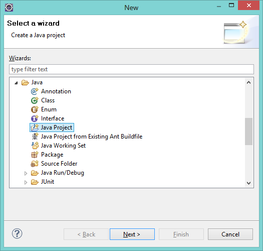
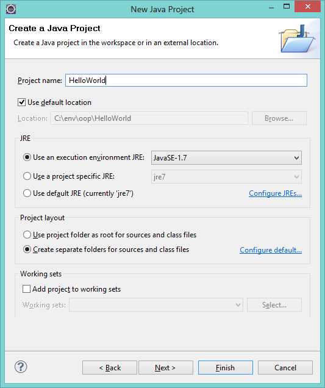
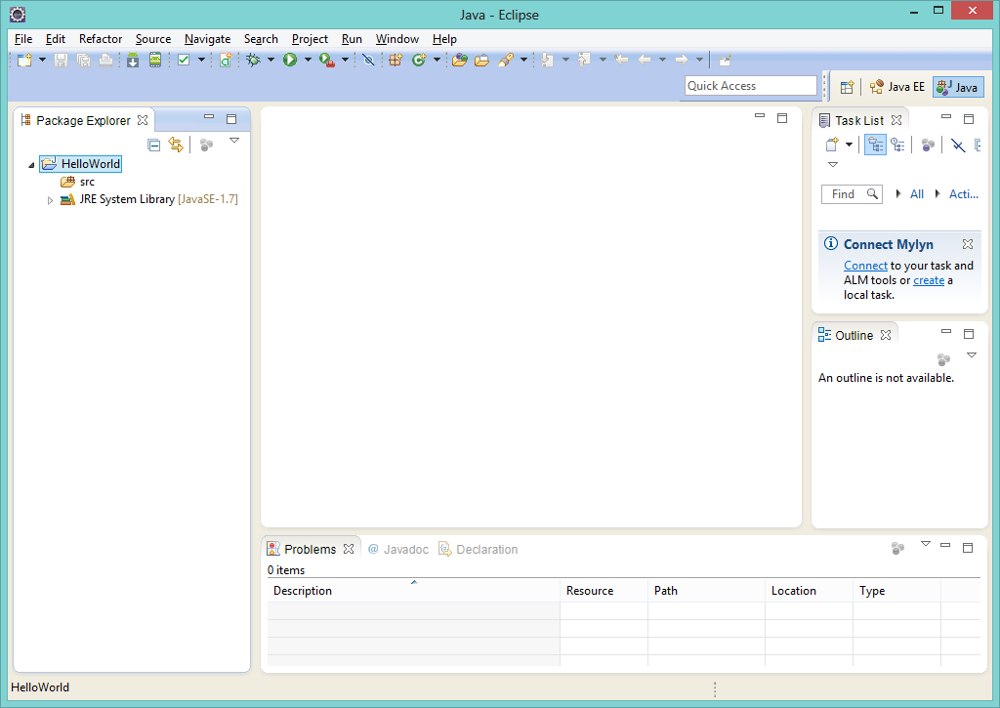
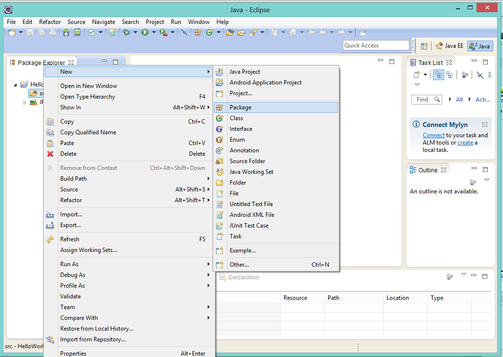
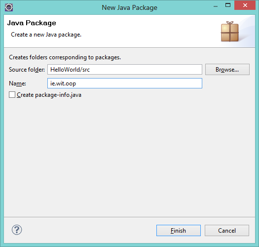
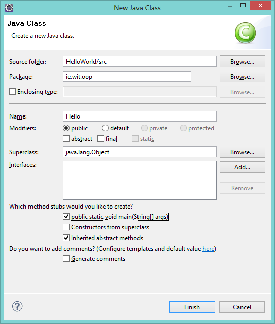
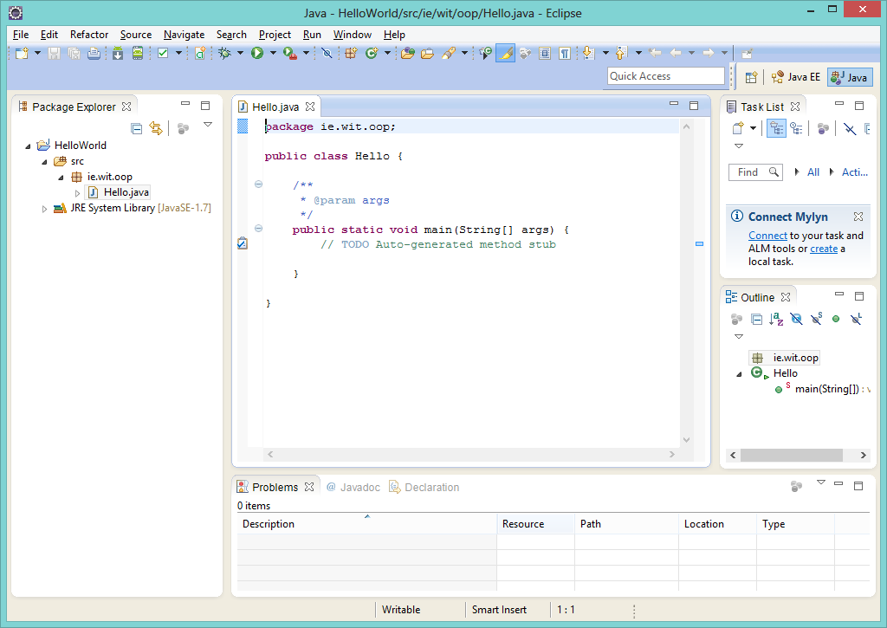

#First Java Project - "HelloWorld"

In Eclipse, select File->New->Other. Navigate to Java, and select "Java Project":

Press "Next" and then give the project a name: 

You can select "Finish" at this stage and after you press "Finish", you'll be asked to change the "Perspective" - you should select to "Remember my decision", so check that box and select "Yes". Once you do, you should have something like this (once you expand the folder):

Next, right-mouse-click on the "src" folder select New->Package 

and enter <b>ie.wit.oop</b> as the package name.

Finally, right-mouse-click the newly created package and select New->Class and give it a name, like below:

NOTE: As this is a <b>Program</b> make sure you select/tick the <i>public static void main(String[] args)</i> checkbox, to create the main method stub.

You should now have something like this:

The next step will involve writing some code and running the program.