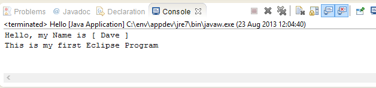
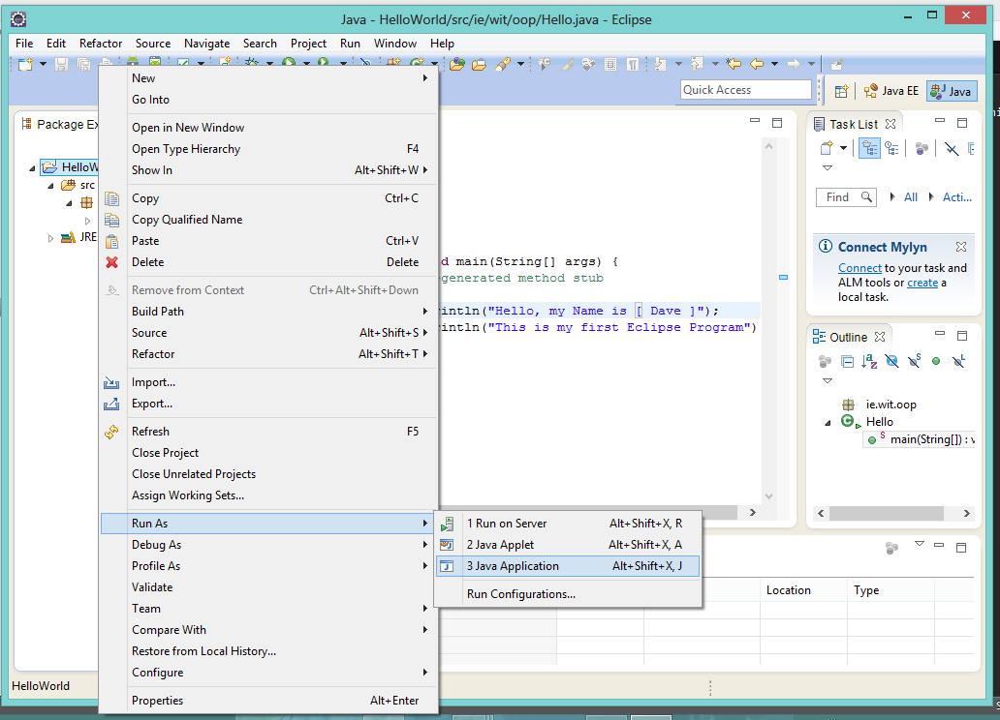

#First Java Project - "HelloWorld Code"

In this Step, you will be required to write some code and run your own version of the classic "Hello World" Program. Your running program should look something like this:

So go ahead, and write the few lines of code necessary to display these messages to the console.

You'll probably have something like this:

~~~java
public class Hello {

    /**
     * @param args
     */
    public static void main(String[] args) {
        // TODO Auto-generated method stub

        System.out.println("Hello, my Name is [ Dave ]");
        System.out.println("This is my first Eclipse Program");
    }

}
~~~

so once you're ready to run the program, right-mouse-click the project name (HelloWorld) in the Eclipse Project Window and select Run As->Java Application, as follows:

And basically, that's how to use Eclipse :-)

We'll look at other features of Eclipse in the next few Labs.