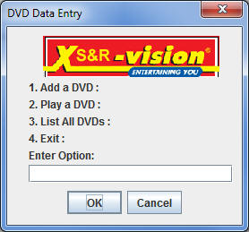
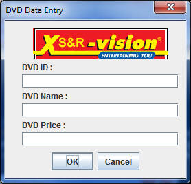

#Step 3 - class DvdManager

The <c1><b>DvdManager</b></c1> class is where most of the work will be done, including the menu options (as in the screen shots below) so to get you started you should replace your existing <c1><b>DvdManager</b></c1> class with the code below.

and if the user chose Option 1, they would get this

<i><b>It's worth noting that allowing the user to enter an ID instead of auto-generating one is NOT GOOD PRACTICE, so this is something you should rectify eventually.</b></i>

~~~java
public class DvdManager 
{
private static Icon myIcon = new ImageIcon("..\\DSProject.Ver.1.0\\images\\logosmall.gif");
private static Icon anIcon = new ImageIcon();
private static int currentSize = 0, maxSize = 5;

private Dvd[] DeviceList = new Dvd[maxSize];

///////////////////////////////////////////////////////////////////
public DVDManager()
{
Dvd aDVD = new Dvd(101,"Batman",9.99);
DeviceList[currentSize] = aDVD;
currentSize++;
}
////////////////////////////////////////////////////////////////// 

public int menuMain()
{
int option = 0;

String opt1 = new String("1. Add a DVD :");
String opt2 = new String("2. Play a DVD :");
String opt3 = new String("3. List All DVDs :");
String opt4 = new String("4. Exit :");
String msg = new String("Enter Option:");
JTextField opt = new JTextField("");

Object message[] = new Object[7];

message[0] = myIcon;
message[1] = opt1;
message[2] = opt2;
message[3] = opt3;
message[4] = opt4;
message[5] = msg;
message[6] = opt;

int response = JOptionPane.showConfirmDialog(null,message,"DVD Data Entry",JOptionPane.OK_CANCEL_OPTION,
JOptionPane.QUESTION_MESSAGE ,anIcon);

    if(response == JOptionPane.CANCEL_OPTION)
    ;
    else
    {
    try {
        option = Integer.parseInt( opt.getText());
        }
    catch (Exception e)
        {
        JOptionPane.showMessageDialog(null,"Data Input Error" + e + "\nPlease Try Again");
        }
    }
    return option;
 } 
///////////////////////////////////////////////////////////////
public void menuAddDvd()
{
String msgID = new String("DVD ID :");
String msgName = new String("DVD Name :");
String msgPrice = new String("DVD Price :");
JTextField id = new JTextField("");
JTextField name = new JTextField("");
JTextField price = new JTextField("");

Object message[] = new Object[7];

message[0] = myIcon;
message[1] = msgID;
message[2] = id;
message[3] = msgName;
message[4] = name;
message[5] = msgPrice;
message[6] = price;

int response = JOptionPane.showConfirmDialog(null,message,"DVD Data Entry",JOptionPane.OK_CANCEL_OPTION,
JOptionPane.QUESTION_MESSAGE ,anIcon);

    if(response == JOptionPane.CANCEL_OPTION)
    ;
    else
    {
    try {

    /*
    Insert the necessary code here to create a Dvd object, set it's 
    properties, and add it to the DeviceList array
    */
}
catch (Exception e)
{
JOptionPane.showMessageDialog(null,"Data Input Error" + e + "\nPlease Try Again");
}
}
}

//////////////////////////////////////////////////////////////////
public void menuPlayDvd()
{
    /*
    Insert the necessary code here to ask the user for a DVD Id 
    look it up in the DeviceList Array, and 'play' it

    The play() method is an extra method in the Dvd class that needs
    to be written, which just displays a simple message to the User

    "This is a Clip of XYZ video playing" where XYZ is the title of the
    Dvd
    */

}
//////////////////////////////////////////////////////////////////////////////////////
public void menuListDvds()
{
    /*
    Insert the necessary code here to display the DeviceList 
    array to the User
    */
}

}
~~~

We will investigate this class closer during the lab.
