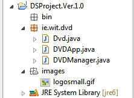

#Step 4 - Image Support

At this stage it's probably a good idea to build and run your project (even with the skeleton code above), just to make sure everything is configured correctly and that the menu options work as expected, before you code the methods. 

Next, add a new 'folder' and name it images. This is where you will store the logo (if you want to use the image of course) You can get the image [here](../img/logosmall.gif).

Your project should now look like this

