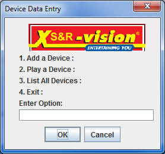
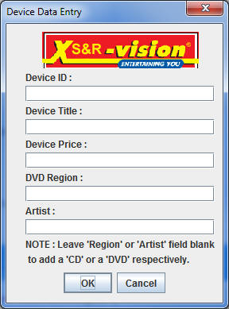
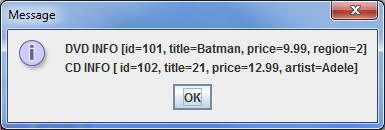
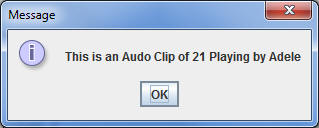

#Step 3 - Refactoring DvdManager

At this stage it's probably a good idea to build and run your project just to make sure everything is configured correctly and that the menu options work as expected, before you refactor the methods, so correct and residual errors and test your application. 

Again, the <c1><b>DvdManager</b></c1> class is where a good bit of the work will be done, including the menu options, so you should refactor your existing <c1><b>DvdManager</b></c1> class to display the relevant menus (as in the screen shots below).

Our Main Menu

Adding a Device

Listing our Devices

Playing a Device

You will then need to refactor your existing code so that the user can add either a 'Dvd' or a 'Cd' depending on the data entered. If you've implemented the inheritance hierarchy correctly, there should be minimal changes to the other 'List' and 'Play' options.