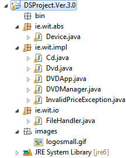

#Objectives

In this Lab, you will be required to refactor your Eclipse Project from Lab 3 based on managing Devices, and develop a new project called <c1><b>DSProject.Ver.3.0</b></c1> (as seen below), to build in some custom exceptions.

The finished application allows a user to 

- 'add' a 'Device', (ie a DVD or a CD) where they enter the relevant details via a UI menu

- 'play' a 'Device' based on entering the Device ID number and

- list' all 'Devices' (both DVDs & CDs) currently in the 'database' and

- display a suitable error message if the user tries to set a negative price for a device

- <c1><b>Be able to store and retrieve our 'Devices' to/from a file</b><c1>

and will look like the following

