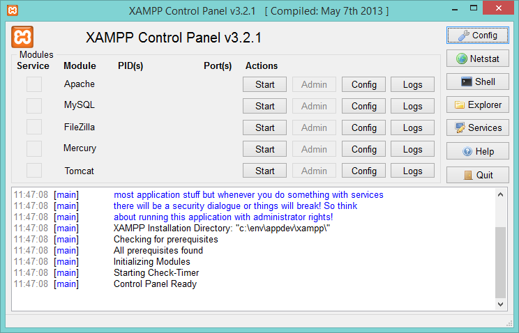
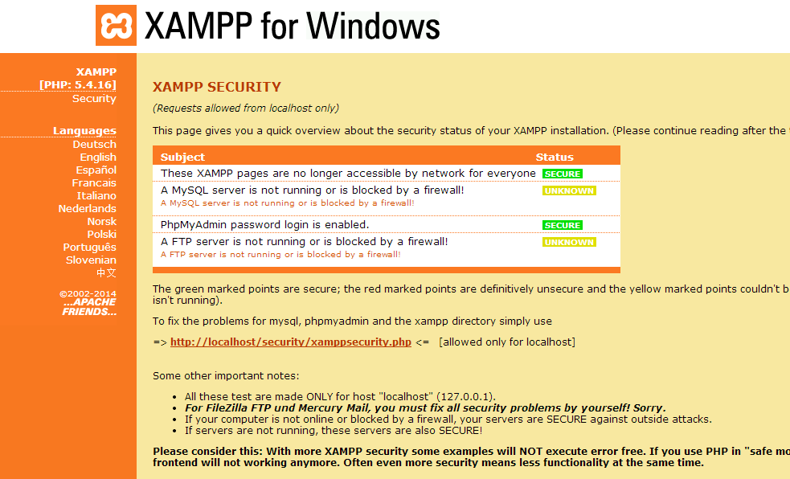
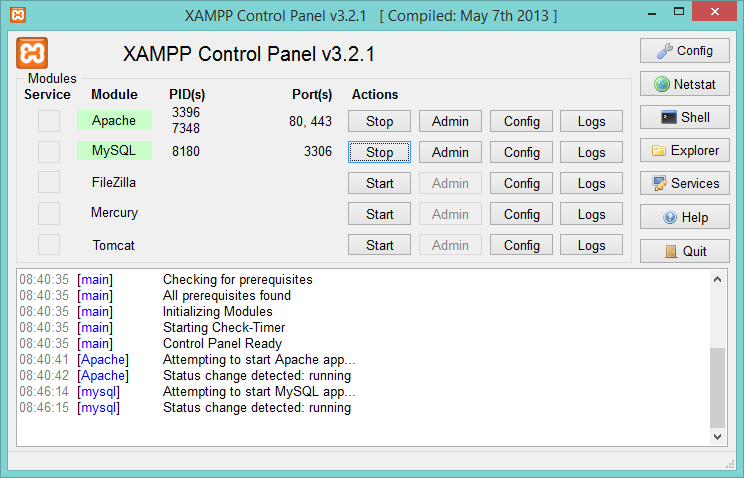
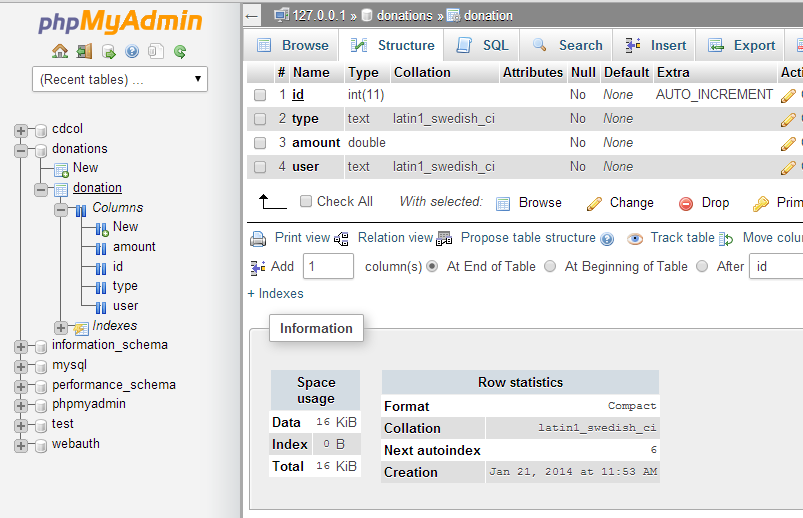
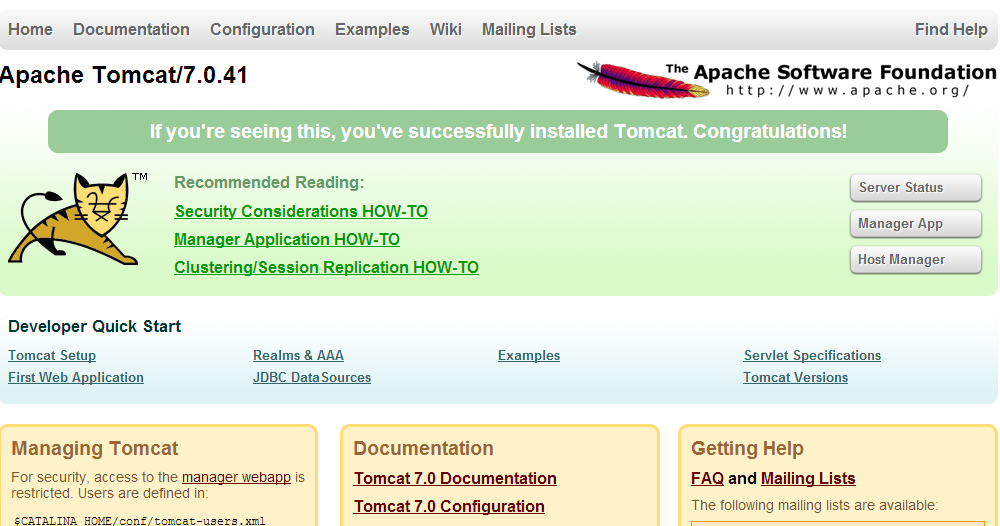

#XAMPP Setup

For the purposes of this lab we will be using XMAPP to run our MySql database and Tomcat Server, so if you haven't done so already, download and install XAMPP [here](http://www.apachefriends.org/download.html).

When you launch the XAMPP Control Panel you should see something like this:)

so the next thing you should do is 'secure' your server by starting the Apache Server and selecting the 'Admin' option - you will be presented with a 'Welcome Screen' in a browser so proceed to select the 'Security' link and set up a user/password for the Server.

Once you have your Apache Server secured, you can set up your MySql database for the lab.

Return to your XAMPP Control Panel and start the MySql server, like so

 

 Then select the 'Admin' option (to get the phpmyadmin browser console) and create a new database 'donations' with one table 'donation' and the following structure

 

 Insert a few records so that we have some data available to us later.

 The last thing to do is set up your Tomcat Server, so again, start and choose the 'Admin' option to get the following:

 

We will configure the privilages we need during the lab.