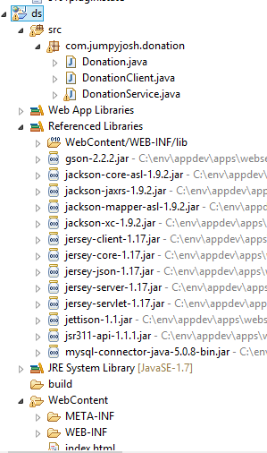

#Setup - Create a New Project

First of all, click [here](http://www.getpostman.com) to install a REST API Client App and then paste in this url <i>http://www.jumpyjosh.com/ds/rest/api/getall</i> to see the Live Web Service (this will return a JSON string of donation objects in a remote mysql database).

Your finished project should looks as follows: (Although I've called the project 'ds' in the screenshot)

Now, Launch Eclipse and create a new Dynamic Web Application Project called <b>DonationService</b> (as above). Follow the instructions from the [Lectures](http://www.jumpyjosh.com/downloads/dwd/lectures/pdfs/rest.pdf) (Slides 30/31) to ensure you install the Jersey libraries and configure your web.xml correctly.

Alternatively, you can download an archive of the jersey libraries and Gson [here](../archives/lib.zip)

 