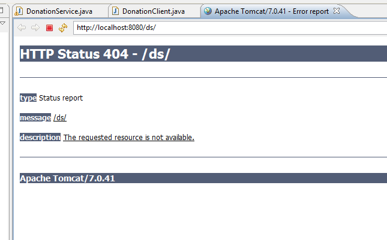
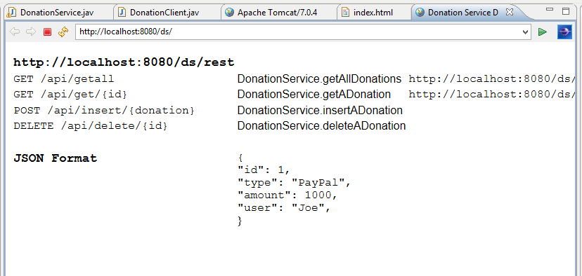
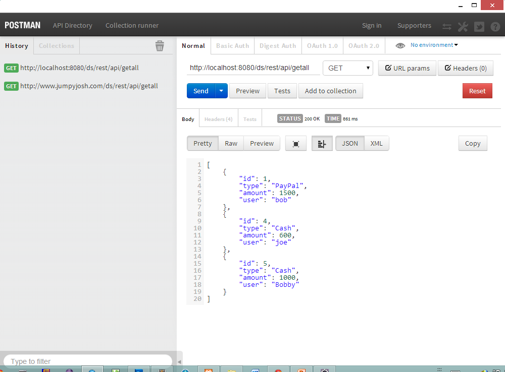
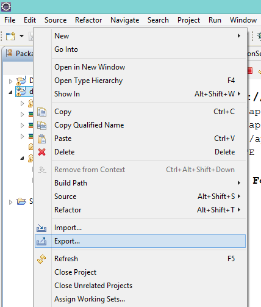
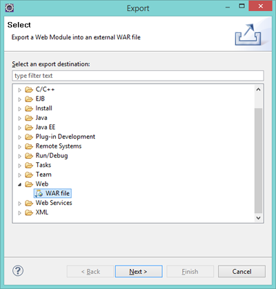

#Deploying the Web Service

To confirm our service will operate as intended, we fisrt need to deploy the service - in our case we will deploy the service to our Tomcat server running via XAMPP.

First of all, we will test it within eclipse, so simply just run the <b>DonationService</b> Web App - you may get something like the following

This is because you are not automatically supplied with a default 'homepage' when you create a new Dynamic Web Project in eclipse - add the following index page to your project and run your app again.

~~~html
<!DOCTYPE html PUBLIC "-//W3C//DTD XHTML 1.0 Transitional//EN" "http://www.w3.org/TR/xhtml1/DTD/xhtml1-transitional.dtd">
<html xmlns="http://www.w3.org/1999/xhtml">

<head>
<meta content="en-ie" http-equiv="Content-Language" />
<meta content="text/html; charset=utf-8" http-equiv="Content-Type" />
<title>Donation Service Details</title>

</head>

<body>

<table style="width: 100%">
	<tr>
		<td class="auto-style1" style="width: 322px"><strong>
		http://localhost:8080/ds/rest</strong></td>
		<td style="width: 287px">&nbsp;</td>
		<td>&nbsp;</td>
	</tr>
	<tr>
		<td class="auto-style2" style="width: 322px">GET /api/getall</td>
		<td class="auto-style3" style="width: 287px">
		DonationService.getAllDonations</td>
		<td class="auto-style2">http://localhost:8080/ds/rest/api/getall</td>
	</tr>
	<tr>
		<td class="auto-style2" style="width: 322px">GET /api/get/{id}</td>
		<td class="auto-style3" style="width: 287px">
		DonationService.getADonation</td>
		<td class="auto-style2">http://localhost:8080/ds/rest/api/get/1</td>
	</tr>
	<tr>
		<td class="auto-style2" style="width: 322px">POST /api/insert/{donation}
		</td>
		<td class="auto-style3" style="width: 287px">
		DonationService.insertADonation</td>
		<td class="auto-style3">&nbsp;</td>
	</tr>
	<tr>
		<td class="auto-style2" style="width: 322px">DELETE /api/delete/{id}&nbsp;&nbsp;&nbsp;
		</td>
		<td class="auto-style3" style="width: 287px">
		DonationService.deleteADonation</td>
		<td class="auto-style3">&nbsp;</td>
	</tr>
	<tr>
		<td style="width: 322px">&nbsp;</td>
		<td style="width: 287px">&nbsp;</td>
		<td>&nbsp;</td>
	</tr>
	<tr>
		<td class="auto-style1" style="width: 322px" valign="top"><strong>JSON 
		Format</strong></td>
		<td style="width: 287px">{ 
		&quot;id&quot;: 1, 
		&quot;type&quot;: &quot;PayPal&quot;, 
		&quot;amount&quot;: 1000, 
		&quot;user&quot;: &quot;Joe&quot;, 
		}</td>
		<td>&nbsp;</td>
	</tr>
</table>

</body>

</html>
~~~

You should now see something like this:

Test your service via POSTMan to confirm everything is ok.

You should be seeing something like this:

Finally, export your Web App as a 'war' file...

and

and upload it to Tomcat via XAMPP (I'll show you how to do this in the lab.) and test your service again.